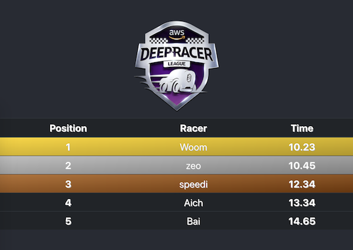

# Leaderboard



## Setup Google Spreedsheet

The spreedsheet looks like this:

|A|B|
|:--|:--|
|Woom|10.23|
|speedi|12.34|
|Ach|13.34|
|Tomi|18.36|

## Setup Client Config

Create the serivce account credentials from [Google API console](https://console.developers.google.com/getting-started)

Download and rename to `credentials.json` and keep under ./backend

Find the `client_email` from `credentials.json` looks like below

```json
{
  "client_email": "leaderboard@<project-12345>.iam.gserviceaccount.com"
}
```

Share the Google spreadsheet to this email

## To run the stack locally

```bash
docker-compose up --build
```

visit http://localhost:3000
